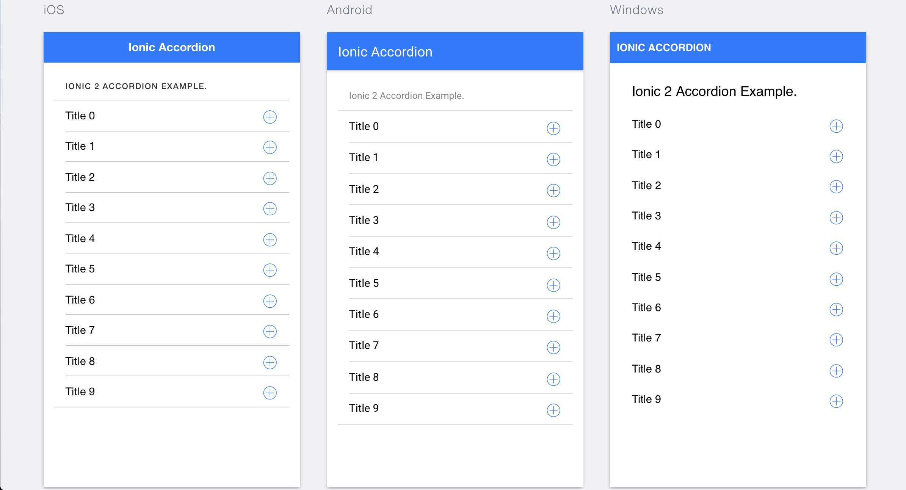

## Ionic 2 Accordion Application

This is a simple variant implementation of an accordion within ionic 2

## Getting Started

* Clone this repository.
* Want to use TypeScript? Both the `master` branch and the `typescript` branch now use TypeScript.
* Run `npm install` from the project root.
* Install the ionic CLI (`npm install -g ionic`)
* Run `ionic serve` in a terminal from the project root.
* Profit

**Note:** Is your build slow? Update `npm` to 3.x: `npm install -g npm`.

## App Preview

All app preview screenshots were taken by running `ionic serve --lab` on a retina display.

  
